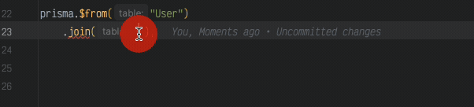
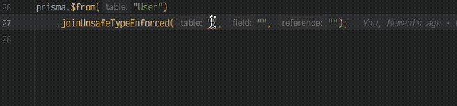
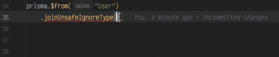
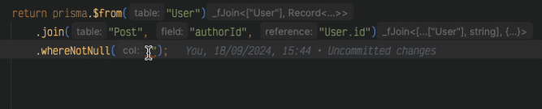
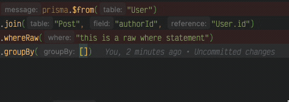

# prisma-ts-select


## Test Matrix

|                | SQLite | MySQL | PostgreSQL |
|----------------|--------|-------|------------|
| **Prisma v6**  |  |  |  |
| **Prisma v7**  |  |  |  |

<!-- toc -->

  * [Summary](#summary)
  * [Installation](#installation)
  * [Supported DBs](#supported-dbs)
  * [Usage](#usage)
    + [Generator](#generator)
  * [API](#api)
    + [`.$from`](#from)
      - [Example](#example)
      - [Example - With Table Alias](#example---with-table-alias)
        * [SQL](#sql)
      - [Example - Inline Alias Syntax](#example---inline-alias-syntax)
        * [SQL](#sql-1)
    + [Table Aliases](#table-aliases)
      - [Table Alias Syntax Options](#table-alias-syntax-options)
      - [Basic Table Alias](#basic-table-alias)
        * [SQL](#sql-2)
      - [Table Aliases with Joins](#table-aliases-with-joins)
        * [Inline Alias Syntax](#inline-alias-syntax)
        * [Object Syntax](#object-syntax)
        * [SQL](#sql-3)
      - [Self-Joins with Aliases](#self-joins-with-aliases)
        * [SQL](#sql-4)
      - [Table.* with Aliases](#table-with-aliases)
        * [SQL](#sql-5)
        * [SQL](#sql-6)
    + [Joins](#joins)
      - [`.join`](#join)
        * [Example](#example-1)
        * [SQL](#sql-7)
        * [Parameters](#parameters)
      - [`.joinUnsafeTypeEnforced`](#joinunsafetypeenforced)
        * [Example](#example-2)
        * [SQL](#sql-8)
        * [Parameters](#parameters-1)
      - [`.joinUnsafeIgnoreType`](#joinunsafeignoretype)
        * [Example](#example-3)
        * [SQL](#sql-9)
        * [Parameters](#parameters-2)
    + [Where](#where)
      - [`.where`](#where)
        * [TypeSyntax](#typesyntax)
        * [Operation types](#operation-types)
        * [Examples](#examples)
          + [Columns](#columns)
          + [$AND](#and)
          + [$OR](#or)
          + [$NOT](#not)
          + [$NOR](#nor)
      - [`.whereNotNull`](#wherenotnull)
        * [Example](#example-4)
        * [SQL](#sql-10)
      - [`.whereIsNull`](#whereisnull)
        * [Example](#example-5)
        * [SQL](#sql-11)
      - [`.whereRaw`](#whereraw)
        * [Example](#example-6)
        * [SQL](#sql-12)
    + [Group By](#group-by)
      - [Example](#example-7)
      - [SQL](#sql-13)
    + [Selecting](#selecting)
      - [`.selectDistinct`](#selectdistinct)
      - [Example](#example-8)
      - [SQL](#sql-14)
      - [`.selectAll`](#selectall)
      - [Example - Single Table](#example---single-table)
        * [SQL](#sql-15)
      - [Example - Join table](#example---join-table)
        * [SQL](#sql-16)
      - [`.selectAllOmit`](#selectallomit)
      - [`.select`](#select)
      - [Example - `*`](#example---)
        * [SQL](#sql-17)
      - [Example - `Table.*` (Single Table)](#example---table-single-table)
        * [SQL](#sql-18)
      - [Example - `Table.*` (With Join)](#example---table-with-join)
        * [SQL](#sql-19)
      - [Example - Chained](#example---chained)
        * [SQL](#sql-20)
      - [Example - Join + Chained](#example---join--chained)
        * [SQL](#sql-21)
      - [Example - Column Aliases](#example---column-aliases)
        * [SQL](#sql-22)
      - [Example - Aliases with Joins](#example---aliases-with-joins)
        * [SQL](#sql-23)
    + [Having](#having)
      - [Example](#example-9)
        * [SQL](#sql-24)
    + [Order By](#order-by)
      - [Example](#example-10)
        * [SQL](#sql-25)
    + [Limit](#limit)
      - [Example](#example-11)
        * [SQL](#sql-26)
    + [Offset](#offset)
      - [Example](#example-12)
        * [SQL](#sql-27)
  * [Select Functions](#select-functions)
    + [Shared (all dialects)](#shared-all-dialects)
    + [MySQL-specific](#mysql-specific)
    + [PostgreSQL-specific](#postgresql-specific)
    + [SQLite-specific](#sqlite-specific)
  * [Future updates](#future-updates)
  * [Changelog / Versioning](#changelog--versioning)
  * [License](#license)
- [prisma-ts-select](#prisma-ts-select)
  * [Install](#install)
  * [Setup](#setup)
    + [Extract](#extract)
  * [Usage](#usage-1)

<!-- tocstop -->

## Summary

**prisma-ts-select** is a TypeScript utility for enhancing the Prisma ORM. 
It simplifies the selection of fields in Prisma queries, ensuring type safety and reducing boilerplate when working with nested fields. 
Ideal for developers seeking an efficient, type-safe way to select data with Prisma in TypeScript.

[!NOTE]
> This has been built mostly around MySQL. Most methods should work across the board.<br/>
> Known exceptions include:
> - HAVING
>   - SQLite 
>     - Requires you to have either an aggregate function in the `SELECT` or make use of `GROUP BY`
>     - Can only use columns that are specified in `SELECT` or `GROUP BY`


## Installation

Install via:

```bash
npm install prisma-ts-select
pnpm add prisma-ts-select
```

## Supported DBs
 
Fully tested on:

- SQLite
- MySQL
- PostgreSQL

Other DBs will be added when I have chance.

## Usage

### Generator

Set up the needed generator.

```prisma

generator prisma-ts-select {
  provider = "prisma-ts-select"
}

```

Run the prisma generator to build the needed files

```shell
pnpm exec prisma generate --generator prisma-ts-select
```

After that is done, we can extend the PrismaClient:

```typescript
import { PrismaClient } from "@prisma/client";
import prismaTSSelect from "prisma-ts-select/extend";

const prisma = new PrismaClient().$extends(prismaTSSelect);
```

Then we can use it like:

```typescript
const results = await prisma.$from("<table>")
    .select("<column>")
    .run()
console.log(results);
```

## API

The way the methods are chained, are heavily inspired by [Dr Milan Milanović](https://substack.com/@techworldwithmilan) with his [How To Learn SQL? > Queries Execution Order](https://newsletter.techworld-with-milan.com/i/112786032/sql-queries-execution-order) post.

1. Sources
   1. `from`
   2. `join`(s)
2. `where`
3. `groupBy`
4. `select`
5. `having`
6. `orderBy`
7. `limit`
8. `offset`

### `.$from`
This takes the `base` table to work from.

#### Example
```typescript file=../usage/tests/readme/from-basic.ts region=example
prisma.$from("User");
```

#### Example - With Table Alias
```typescript file=../usage/tests/readme/from-inline-alias.ts region=example
prisma.$from("User u");
```
##### SQL
```sql file=../usage/tests/readme/from-inline-alias.ts region=inline-alias-sql
FROM User AS `u`;
```
**Note:** Alias can be inline (space-separated) or as second parameter.
**Note:** Table aliases are particularly useful for self-joins where you need to join a table to itself with different aliases.


### Table Aliases

Table aliases allow you to give tables shorter or more meaningful names in your queries. This is especially useful for:
- Self-joins (joining a table to itself)
- Long table names
- Clearer query readability

#### Table Alias Syntax Options

Multiple syntaxes supported:
- **Inline in .$from()**: `prisma.$from("User u")` - Note: Second parameter syntax `.$from("User", "u")` is NOT supported
- **Inline in .join()**: `.join("Post p", "authorId", "User.id")`
- **Object syntax**: `.join({table: "Post", src: "authorId", on: "User.id", alias: "p"})`

#### Table Aliases with Joins

##### Inline Alias Syntax
```typescript file=../usage/tests/readme/table-alias.ts region=inline-join
prisma.$from("User u")
      .join("Post p", "authorId", "u.id")
      .select("u.name")
      .select("p.title");
```

##### Object Syntax
```typescript file=../usage/tests/readme/table-alias.ts region=object-join
prisma.$from("User u")
      .join({table: "Post", src: "authorId", on: "u.id", alias: "p"})
      .select("u.name")
      .select("p.title");
```

##### SQL
```sql file=../usage/tests/readme/table-alias.ts region=inline-join-sql
SELECT name, title
FROM User AS `u`
JOIN Post AS `p` ON p.authorId = u.id;
```

**Note:** The object syntax provides a foundation for future enhancements like multiple join conditions and complex WHERE-style conditions in joins.

#### Self-Joins with Aliases

Self-joins require aliases to distinguish between the different "instances" of the same table:

```typescript file=../usage/tests/readme/table-alias.ts region=self-join
prisma.$from("User u1")
      .joinUnsafeTypeEnforced("User u2", "id", "u1.id")
      .select("u1.name", "user1Name")
      .select("u2.name", "user2Name");
```

##### SQL
```sql file=../usage/tests/readme/table-alias.ts region=self-join-sql
SELECT 
  u1.name AS `user1Name`,
  u2.name AS `user2Name`
FROM User AS `u1`
JOIN User AS `u2` ON u2.id = u1.id;
```

#### Table.* with Aliases

You can use the `alias.*` syntax to select all columns from an aliased table:

```typescript file=../usage/tests/readme/table-alias.ts region=star-single
prisma.$from("User u")
      .select("u.*");
```

##### SQL
```sql file=../usage/tests/readme/table-alias.ts region=star-single-sql
SELECT 
  id,
  email,
  name,
  age
FROM User AS `u`;
```

With joins:
```typescript file=../usage/tests/readme/table-alias.ts region=star-join
prisma.$from("User u")
      .join("Post p", "authorId", "u.id")
      .select("u.*")
      .select("p.*");
```

##### SQL
```sql file=../usage/tests/readme/table-alias.ts region=star-join-sql
SELECT 
  u.id AS `u.id`,
  u.email AS `u.email`,
  u.name AS `u.name`,
  u.age AS `u.age`,
  p.id AS `p.id`,
  p.title AS `p.title`,
  p.content AS `p.content`,
  p.published AS `p.published`,
  p.authorId AS `p.authorId`,
  p.lastModifiedById AS `p.lastModifiedById`
FROM User AS `u`
JOIN Post AS `p` ON p.authorId = u.id;
```

### Joins
#### `.join`

Using the defined links (foreign keys) defined in the schema, provides a type-safe way of joining on tables.

##### Example
```typescript file=../usage/tests/readme/join-basic.ts region=example
prisma.$from("User")
      .join("Post", "authorId", "User.id");
```



##### SQL

The resulting SQL will look like:

```sql file=../usage/tests/readme/join-basic.ts region=join-basic-sql
FROM User
JOIN Post ON Post.authorId = User.id;
```

##### Parameters
| column      | Description                                                                                                                                                    |
|-------------|----------------------------------------------------------------------------------------------------------------------------------------------------------------|
| `table`     | The table to join on (supports inline alias: `"Post p"` or `"Post", "p"`). <br/>TS autocomplete will show tables that can join with previously defined tables on. |
| `field`     | Column on table. <br/>TS autocomplete will show known columns that this table, can join with previously defined tables on.                                     |
| `reference` | `Table.Column` to a previously defined table (either the base, or another join), with a FK that is defined in the schema definition.                           |

**Alternative Syntaxes:**
```typescript
// Inline alias
.join("Post p", "authorId", "User.id")
    
// Object syntax
.join({
  table: "Post",
  src: "authorId",
  on: "User.id",
  alias: "p"  // optional
})
``` 

#### `.joinUnsafeTypeEnforced`

Unlike the `.join` command, this will allow you to join on columns that are not explicitly linked by a FK, but have the same type.

##### Example
```typescript file=../usage/tests/readme/join-unsafe.ts region=type-enforced
prisma.$from("User")
      .joinUnsafeTypeEnforced("Post", "title", "User.name");
```


##### SQL
The resulting SQL will look like:

```sql file=../usage/tests/readme/join-unsafe.ts region=type-enforced-sql
FROM User
JOIN Post ON Post.title = User.name;
```

##### Parameters
| column      | Description                                                                                                                                                    |
|-------------|----------------------------------------------------------------------------------------------------------------------------------------------------------------|
| `table`     | The table to join on (supports inline alias: `"Post p"` or `"Post", "p"`). <br/>TS autocomplete will show tables that can join with previously defined tables on. |
| `field`     | Column on table. <br/>TS autocomplete will show known columns that this table, can join with previously defined tables on.                                     |
| `reference` | `Table.Column` to a previously defined table (either the base, or another join), with a column that is of the same type.                                       |

#### `.joinUnsafeIgnoreType`

Unlike the `.joinUnsafeIgnoreType` command, this will allow you to join on columns that are not explicitly linked by a FK, and do not have the same type.

##### Example
```typescript file=../usage/tests/readme/join-unsafe.ts region=ignore-type
prisma.$from("User")
      .joinUnsafeIgnoreType("Post", "id", "User.name");
```


##### SQL
The resulting SQL will look like:

```sql file=../usage/tests/readme/join-unsafe.ts region=ignore-type-sql
FROM User
JOIN Post ON Post.id = User.name;
```

##### Parameters
| column      | Description                                                                                                                                                    |
|-------------|----------------------------------------------------------------------------------------------------------------------------------------------------------------|
| `table`     | The table to join on (supports inline alias: `"Post p"` or `"Post", "p"`). <br/>TS autocomplete will show tables that can join with previously defined tables on. |
| `field`     | Column on table. <br/>TS autocomplete will show known columns that this table, can join with previously defined tables on.                                     |
| `reference` | `Table.Column` to a previously defined table (either the base, or another join). Referencing any column, of any type.                                          |

### Where

#### `.where`

The `where` syntax takes inspiration from how mongoDB does queries.

##### TypeSyntax
```TypeScript
type WhereClause = {
  "Table.Column": <value> | { "op": "<condition>", "value": <value> }
  "$AND": [WhereClause, ...Array<WhereClause>],
  "$OR": [WhereClause, ...Array<WhereClause>],
  "$NOT": [WhereClause, ...Array<WhereClause>],
  "$NOR": [WhereClause, ...Array<WhereClause>]
}
```

##### Operation types
| Op          | Description | Supported Types       |
|-------------|-------------|-----------------------|
| IN          |             | Numbers, String, Date |
| NOT IN      |             | Numbers, String, Date |
| BETWEEN     |             | Numbers, Date         |
| LIKE        |             | String                |
| NOT LIKE    |             | String                |
| IS NULL     |             | *                     |
| IS NOT NULL |             | *                     |
| \>          |             | Numbers, Date         |
| \>=         |             | Numbers, Date         |
| <           |             | Numbers, Date         |
| <=          |             | Numbers, Date         |
| !=          |             | Numbers, String, Date |
| =           |             | Numbers, String, Date |


##### Examples
| Type         | Description                                                              | Example                                                                                                                                                          | SQL                                                               | 
|--------------|--------------------------------------------------------------------------|------------------------------------------------------------------------------------------------------------------------------------------------------------------|-------------------------------------------------------------------|
| Table.Column | A particular Table.Column name                                           | <pre>.where({ <br />  "User.age": 20,<br />  "User.name": {op: "LIKE", value:"Stuart%"},<br />})                                                                 | `(User.age = 20 AND User.name LIKE "Stuart%")`                    |
| $AND         | Will join all items with a `AND`                                         | <pre>.where({ <br /> $AND:[<br />  {"User.age": {op: ">", value:20}},<br />  {"User.age": {op: "<", value:60}},<br />]})</pre>                                   | `(User.age > 20 AND User.age < 60)`                               |
| $OR          | Will join all items with a `OR`                                          | <pre>.where({ <br /> $OR:[<br />  {"User.name": {op: "LIKE", value:"a%"}},<br />  {"User.name": {op: "LIKE", value:"d%"}},<br />]})</pre>                        | `(User.name LIKE "a%" OR User.name LIKE "d%")`                    |
| $NOT         | Will wrap statement in a `NOT (/*...*/)` and join any items with a `AND` | <pre>.where({ <br /> $NOT:[<br />  {"User.age": 20 },<br />  {<br />    "User.age": {op: "=", value:60},<br />    "User.name": "Bob",<br />   },<br />]})</pre>  | `(NOT (User.age = 20 AND (User.age = 60 AND User.name = "Bob")))` |
| $NOR         | Will wrap statement in a `NOT (/*...*/)` and join any items with a `OR`  | <pre>.where({ <br /> $NOR:[<br />  {"User.age": 20 },<br />  {<br />    "User.age": {op: "!=", value:60},<br />    "User.name": "Bob",<br />   },<br />]})</pre> | `(NOT (User.age = 20 OR (User.age != 60 AND User.name = "Bob")))` |


###### Columns
```typescript file=../usage/tests/readme/where.ts region=columns
prisma.$from("User")
      .joinUnsafeIgnoreType("Post", "id", "User.name")
      .where({
        "User.age": 20,
        "User.name": {op: "LIKE", value: "Stuart%"},
      });
```

###### $AND
```typescript file=../usage/tests/readme/where.ts region=and
prisma.$from("User")
      .joinUnsafeIgnoreType("Post", "id", "User.name")
      .where({
        $AND: [
          {"User.age": {op: ">", value: 20}},
          {"User.age": {op: "<", value: 60}},
        ]
      });
```

###### $OR
```typescript file=../usage/tests/readme/where.ts region=or
prisma.$from("User")
      .joinUnsafeIgnoreType("Post", "id", "User.name")
      .where({
        $OR: [
          {"User.name": {op: "LIKE", value: "a%"}},
          {"User.name": {op: "LIKE", value: "d%"}},
        ]
      });
```

###### $NOT
```typescript file=../usage/tests/readme/where.ts region=not
prisma.$from("User")
      .joinUnsafeIgnoreType("Post", "id", "User.name")
      .where({
        $NOT: [
          {"User.age": 20},
          {
            "User.age": {op: "=", value: 60},
            "User.name": "Bob",
          },
        ]
      });
```

###### $NOR
```typescript file=../usage/tests/readme/where.ts region=nor
prisma.$from("User")
      .joinUnsafeIgnoreType("Post", "id", "User.name")
      .where({
        $NOR: [
          {"User.age": 20},
          {
            "User.age": {op: "!=", value: 60},
            "User.name": "Bob",
          },
        ]
      });
```

#### `.whereNotNull`

This will remove the `null` type from the union of types of the current table column.
To use `.whereNotNull`, you need to add it before a `.where`.

##### Example
```typescript file=../usage/tests/readme/where.ts region=not-null
prisma.$from("User")
      .join("Post", "authorId", "User.id")
      .whereNotNull("User.name");
```


##### SQL
The resulting SQL will look like:

```sql file=../usage/tests/readme/where.ts region=not-null-sql
FROM User
JOIN Post ON Post.authorId = User.id
WHERE (User.name IS NOT NULL);
```

#### `.whereIsNull`

This will remove the NonNull type from the union of types of the current table column.
To use `.whereIsNull`, you need to add it before a `.where`.

##### Example
```typescript file=../usage/tests/readme/where.ts region=is-null
prisma.$from("User")
      .join("Post", "authorId", "User.id")
      .whereIsNull("Post.content");
```


##### SQL
The resulting SQL will look like:

```sql file=../usage/tests/readme/where.ts region=is-null-sql
FROM User
JOIN Post ON Post.authorId = User.id
WHERE (Post.content IS NULL);
```

#### `.whereRaw`

When you want to write a complex `where`, or you just don't want the TypeSafety offered by the other methods, you can use `.whereRaw`.

##### Example
```typescript file=../usage/tests/readme/where.ts region=raw
prisma.$from("User")
      .join("Post", "authorId", "User.id")
      .whereRaw("this is a raw where statement");
```

##### SQL
The resulting SQL will look like:

```sql file=../usage/tests/readme/where.ts region=raw-sql
FROM User
JOIN Post ON Post.authorId = User.id
WHERE this is a raw
WHERE statement;
```


### Group By

Will allow you to pass a list of columns, that haven been specified from the `.$from` and any `.join` methods.

#### Example
```typescript file=../usage/tests/readme/groupby.ts region=basic
prisma.$from("User")
      .join("Post", "authorId", "User.id")
      .groupBy(["name", "Post.content"]);
```


#### SQL
The resulting SQL will look like:

```sql file=../usage/tests/readme/groupby.ts region=basic-sql
FROM User
JOIN Post ON Post.authorId = User.id
GROUP BY name, Post.content;
```

### Selecting

#### `.selectDistinct`

Will add the keyword `DISTINCT` after the select.

#### Example
```typescript file=../usage/tests/readme/select-advanced.ts region=distinct
prisma.$from("User")
      .selectDistinct()
      .select("name");
```

#### SQL
The resulting SQL will look like:

```sql file=../usage/tests/readme/select-advanced.ts region=distinct-sql
SELECT DISTINCT name
FROM User;
```

#### `.selectAll`

Works slightly differently to `*`. The limitation of `*` in JS, is that if you have 2 tables with the same name, you will only get back the last, based on a join.
This method will explicitly list all the tables from the `$from` and `.join`. So you get the `table.column` in the respose.


#### Example - Single Table
```typescript file=../usage/tests/readme/select-advanced.ts region=all-single
prisma.$from("User")
      .selectAll();
```

##### SQL
The resulting SQL will look like:

```sql file=../usage/tests/readme/select-advanced.ts region=all-single-sql
SELECT 
  id,
  email,
  name,
  age
FROM User;
```

#### Example - Join table
```typescript file=../usage/tests/readme/select-advanced.ts region=all-join
prisma.$from("User")
      .join("Post", "authorId", "User.id")
      .selectAll();
```

##### SQL
The resulting SQL will look like:

```sql file=../usage/tests/readme/select-advanced.ts region=all-join-sql
SELECT 
  User.id AS `User.id`,
  User.email AS `User.email`,
  User.name AS `User.name`,
  User.age AS `User.age`,
  Post.id AS `Post.id`,
  Post.title AS `Post.title`,
  Post.content AS `Post.content`,
  Post.published AS `Post.published`,
  Post.authorId AS `Post.authorId`,
  Post.lastModifiedById AS `Post.lastModifiedById`
FROM User
JOIN Post ON Post.authorId = User.id;
```

#### `.selectAllOmit`

Like `.selectAll`, but excludes specific columns. Accepts `Table.column` or bare `column` references.

#### Example - Single Table
```typescript file=../usage-sqlite-v7/tests/readme/select-all-omit.ts region=single-omit
prisma.$from("User")
      .selectAllOmit(["User.email"]);
```

##### SQL
```sql file=../usage-sqlite-v7/tests/readme/select-all-omit.ts region=single-omit-sql
SELECT id, name, age FROM User;
```

#### Example - Multiple Columns
```typescript file=../usage-sqlite-v7/tests/readme/select-all-omit.ts region=multi-omit
prisma.$from("User")
      .selectAllOmit(["User.email", "User.age"]);
```

#### Example - With Join
```typescript file=../usage-sqlite-v7/tests/readme/select-all-omit.ts region=join-omit
prisma.$from("User")
      .join("Post", "authorId", "User.id")
      .selectAllOmit(["User.email", "Post.content"]);
```

> **Note:** `*` and `Table.*` are not valid arguments — use `Table.column` or bare `column` references.

#### `.select`

You can supply either; `*`, `Table.*` OR `table.field` and then chain them together.

#### Example - `*`
```typescript file=../usage/tests/readme/select-star.ts region=example
prisma.$from("User")
      .select("*");
```

##### SQL
The resulting SQL will look like:

```sql file=../usage/tests/readme/select-star.ts region=example-sql
SELECT *
FROM User;
```

#### Example - `Table.*` (Single Table)
```typescript file=../usage/tests/readme/select-advanced.ts region=table-star-single
prisma.$from("User")
      .select("User.*");
```

##### SQL
The resulting SQL will look like:

```sql file=../usage/tests/readme/select-advanced.ts region=table-star-single-sql
SELECT 
  id,
  email,
  name,
  age
FROM User;
```

#### Example - `Table.*` (With Join)
```typescript file=../usage/tests/readme/select-advanced.ts region=table-star-join
prisma.$from("User")
      .join("Post", "authorId", "User.id")
      .select("User.*")
      .select("Post.*");
```

##### SQL
The resulting SQL will look like:

```sql file=../usage/tests/readme/select-advanced.ts region=table-star-join-sql
SELECT 
  User.id AS `User.id`,
  User.email AS `User.email`,
  User.name AS `User.name`,
  User.age AS `User.age`,
  Post.id AS `Post.id`,
  Post.title AS `Post.title`,
  Post.content AS `Post.content`,
  Post.published AS `Post.published`,
  Post.authorId AS `Post.authorId`,
  Post.lastModifiedById AS `Post.lastModifiedById`
FROM User
JOIN Post ON Post.authorId = User.id;
```

[!NOTE]
> When using `Table.*` with joins, all columns are automatically aliased with the table name prefix to avoid column name conflicts.

#### Example - Chained
```typescript file=../usage/tests/readme/select-chained.ts region=example
prisma.$from("User")
      .select("name")
      .select("email");
```

##### SQL
The resulting SQL will look like:

```sql file=../usage/tests/readme/select-chained.ts region=example-sql
SELECT name, email
FROM User;
```

#### Example - Join + Chained
```typescript file=../usage/tests/readme/select-advanced.ts region=join-chained
prisma.$from("User")
      .join("Post", "authorId", "User.id")
      .select("name")
      .select("Post.title");
```

##### SQL
The resulting SQL will look like:

```sql file=../usage/tests/readme/select-advanced.ts region=join-chained-sql
SELECT name, title
FROM User
JOIN Post ON Post.authorId = User.id;
```

#### Example - Column Aliases
```typescript file=../usage/tests/readme/select-column-alias.ts region=basic
prisma.$from("User")
      .select("User.name", "username");
```

```typescript file=../usage/tests/readme/select-column-alias.ts region=multiple
prisma.$from("User")
      .select("User.id", "userId")
      .select("User.email", "emailAddress");
```

```typescript file=../usage/tests/readme/select-column-alias.ts region=mixed
prisma.$from("User")
      .select("User.id")
      .select("User.name", "username")
      .select("User.email");
```

##### SQL
The resulting SQL will look like:

```sql file=../usage/tests/readme/select-column-alias.ts region=basic-sql
SELECT User.name AS `username`
FROM User;
```

```sql file=../usage/tests/readme/select-column-alias.ts region=multiple-sql
SELECT 
  User.id AS `userId`,
  User.email AS `emailAddress`
FROM User;
```

```sql file=../usage/tests/readme/select-column-alias.ts region=mixed-sql
SELECT 
  id,
  User.name AS `username`,
  email
FROM User;
```

#### Example - Aliases with Joins
```typescript file=../usage/tests/readme/select-advanced.ts region=aliases-joins
prisma.$from("User")
      .join("Post", "authorId", "User.id")
      .select("User.name", "authorName")
      .select("Post.title", "postTitle");
```

##### SQL
The resulting SQL will look like:

```sql file=../usage/tests/readme/select-advanced.ts region=aliases-joins-sql
SELECT 
  User.name AS `authorName`,
  Post.title AS `postTitle`
FROM User
JOIN Post ON Post.authorId = User.id;
```

[!NOTE]
> When using column aliases, you can reference the alias in `ORDER BY` clauses. The returned type will use the alias names instead of the original column names.

### Having

`.having` uses the same syntax as [`.where`](#where). Please see the previous section for details.

#### Example

```typescript file=../usage/tests/readme/having.ts region=with-groupby
prisma.$from("User")
      .join("Post", "authorId", "User.id")
      .groupBy(["name", "Post.content"])
      .having({
        "User.name": {
          "op": "LIKE",
          "value": "bob%"
        }
      })
      .select("*");
```

```typescript file=../usage/tests/readme/having.ts region=without-groupby
prisma.$from("User")
      .join("Post", "authorId", "User.id")
      .having({
        "User.name": {
          "op": "LIKE",
          "value": "stuart%"
        }
      })
      .select("*");
```


##### SQL

```sql file=../usage/tests/readme/having.ts region=with-groupby-sql
SELECT *
FROM User
JOIN Post ON Post.authorId = User.id
GROUP BY name, Post.content
HAVING User.name LIKE 'bob%';
```

```sql file=../usage/tests/readme/having.ts region=without-groupby-sql
SELECT *
FROM User
JOIN Post ON Post.authorId = User.id
HAVING User.name LIKE 'stuart%';
```

### Order By

`.orderBy`, takes an array of column names, with the optional suffix of `ASC` or `DESC`.

#### Example

```typescript file=../usage/tests/readme/orderby.ts region=basic
prisma.$from("User")
      .join("Post", "authorId", "User.id")
      .orderBy(["name", "Post.content DESC"]);
```

##### SQL

```sql file=../usage/tests/readme/orderby.ts region=basic-sql
FROM User
JOIN Post ON Post.authorId = User.id
ORDER BY name, Post.content DESC;
```

### Limit

`.limit`, takes the number of rows you would like to return.

#### Example

```typescript file=../usage/tests/readme/pagination.ts region=limit
prisma.$from("User")
      .join("Post", "authorId", "User.id")
      .limit(1);
```

##### SQL

```sql file=../usage/tests/readme/pagination.ts region=limit-sql
FROM User
JOIN Post ON Post.authorId = User.id
LIMIT 1;
```

### Offset

`.offSet`, the number of rows to skip. Requires `.limit` to have been used first.

#### Example
```typescript file=../usage/tests/readme/pagination.ts region=offset
prisma.$from("User")
      .join("Post", "authorId", "User.id")
      .limit(1)
      .offset(1);
```

##### SQL

```sql file=../usage/tests/readme/pagination.ts region=offset-sql
FROM User
JOIN Post ON Post.authorId = User.id
LIMIT 1
OFFSET 1;
```

## Select Functions

Pass a callback to `.select()` to use SQL expressions and aggregate functions. The callback receives a context object with all available functions for the active dialect.

### Shared (all dialects)

#### `lit(value)` — SQL literal

Produces a typed SQL literal from a JS value.

##### Example
```typescript file=../usage-sqlite-v7/tests/readme/select-fns.ts region=lit-string
prisma.$from("User")
      .select(({ lit }) => lit("hello"), "greeting");
```

#### `countAll()` — COUNT(*)

The most common aggregate. Always produces `COUNT(*)`.

##### Example
```typescript file=../usage-sqlite-v7/tests/readme/select-fns.ts region=count-all
prisma.$from("User")
      .select(({ countAll }) => countAll(), "total");
```

##### SQL
```sql file=../usage-sqlite-v7/tests/readme/select-fns.ts region=count-all-sql
SELECT COUNT(*) AS `total` FROM User;
```

#### `count(col)` — COUNT(col)

```typescript file=../usage-sqlite-v7/tests/readme/select-fns.ts region=count-col
prisma.$from("User")
      .select(({ count }) => count("User.id"), "cnt");
```

#### `countDistinct(col)` — COUNT(DISTINCT col)

```typescript file=../usage-sqlite-v7/tests/readme/select-fns.ts region=count-distinct
prisma.$from("User")
      .select(({ countDistinct }) => countDistinct("User.id"), "cnt");
```

#### `sum(col)` / `avg(col)` / `min(col)` / `max(col)`

Standard numeric aggregates. **Return types vary by dialect** — `sum` and `avg` return `Decimal` on MySQL (matching Prisma's numeric precision model), `number` on SQLite and PostgreSQL. `min`/`max` always return `T | null` (NULL for empty sets) where `T` is the column's TypeScript type.

| Function | SQLite | MySQL | PostgreSQL |
|---|---|---|---|
| `sum(col)` | `number` | `Decimal` | `number` |
| `avg(col)` | `number` | `Decimal` | `number` |
| `min(col)` | `T \| null` | `T \| null` | `T \| null` |
| `max(col)` | `T \| null` | `T \| null` | `T \| null` |

```typescript file=../usage-sqlite-v7/tests/readme/select-fns.ts region=sum
prisma.$from("User")
      .select(({ sum }) => sum("User.age"), "total");
```

#### Combining with `.groupBy()`

```typescript file=../usage-sqlite-v7/tests/readme/select-fns.ts region=count-groupby
prisma.$from("User")
      .join("Post", "authorId", "User.id")
      .groupBy(["User.name"])
      .select("User.name")
      .select(({ countAll }) => countAll(), "postCount");
```

##### SQL
```sql
SELECT User.name, COUNT(*) AS `postCount`
FROM User
JOIN Post ON Post.authorId = User.id
GROUP BY User.name;
```

---

### MySQL-specific

| Function | SQL | Returns |
|---|---|---|
| `groupConcat(col, sep?)` | `GROUP_CONCAT(col SEPARATOR sep)` | `string` |
| `bitAnd(col)` | `BIT_AND(col)` | `number` |
| `bitOr(col)` | `BIT_OR(col)` | `number` |
| `bitXor(col)` | `BIT_XOR(col)` | `number` |
| `stddev(col)` | `STDDEV(col)` | `number` |
| `stddevSamp(col)` | `STDDEV_SAMP(col)` | `number` |
| `variance(col)` | `VARIANCE(col)` | `number` |
| `varSamp(col)` | `VAR_SAMP(col)` | `number` |
| `jsonArrayAgg(col)` | `JSON_ARRAYAGG(col)` | `JSONValue` |
| `jsonObjectAgg(key, val)` | `JSON_OBJECTAGG(key, val)` | `JSONValue` |

> **Note:** `jsonArrayAgg` and `jsonObjectAgg` require MySQL 5.7.22+.

---

### PostgreSQL-specific

| Function | SQL | Returns |
|---|---|---|
| `stringAgg(col, sep)` | `STRING_AGG(col, sep)` | `string` |
| `arrayAgg(col)` | `ARRAY_AGG(col)` | `unknown[]` |
| `stddevPop(col)` | `STDDEV_POP(col)` | `number` |
| `stddevSamp(col)` | `STDDEV_SAMP(col)` | `number` |
| `varPop(col)` | `VAR_POP(col)` | `number` |
| `varSamp(col)` | `VAR_SAMP(col)` | `number` |
| `boolAnd(col)` | `BOOL_AND(col)` | `boolean` |
| `boolOr(col)` | `BOOL_OR(col)` | `boolean` |
| `jsonAgg(col)` | `JSON_AGG(col)` | `JSONValue[]` |
| `bitAnd(col)` | `BIT_AND(col)` | `number` |
| `bitOr(col)` | `BIT_OR(col)` | `number` |
| `jsonObjectAgg(key, val)` | `JSON_OBJECT_AGG(key, val)` | `JSONValue` |

---

### SQLite-specific

| Function | SQL | Returns |
|---|---|---|
| `groupConcat(col, sep?)` | `GROUP_CONCAT(col, sep)` | `string` |
| `total(col)` | `TOTAL(col)` | `number` |

> **Note:** `total()` behaves like `SUM()` but returns `0.0` instead of `NULL` for empty sets.

---

## Future updates

- Support specifying `JOIN` type [issue#2](https://github.com/adrianbrowning/prisma-ts-select/issues/2)
- Support additional Select Functions
  - [String #5](https://github.com/adrianbrowning/prisma-ts-select/issues/5)
  - [Date & Time #6](https://github.com/adrianbrowning/prisma-ts-select/issues/6)
  - [Math #7](https://github.com/adrianbrowning/prisma-ts-select/issues/7)
  - [Control Flow #8](https://github.com/adrianbrowning/prisma-ts-select/issues/8)
  - [JSON #9](https://github.com/adrianbrowning/prisma-ts-select/issues/9)
- [Support a `Many-To-Many` join #19](https://github.com/adrianbrowning/prisma-ts-select/issues/19)
- [whereRaw supporting Prisma.sql](https://github.com/adrianbrowning/prisma-ts-select/issues/29)

## Changelog / Versioning
Changelog is available [here](https://github.com/adrianbrowning/prisma-ts-select/releases). We use [semantic versioning](https://semver.org/) for versioning.

## License
This project is licensed under the MIT License. See the LICENSE file for details.


